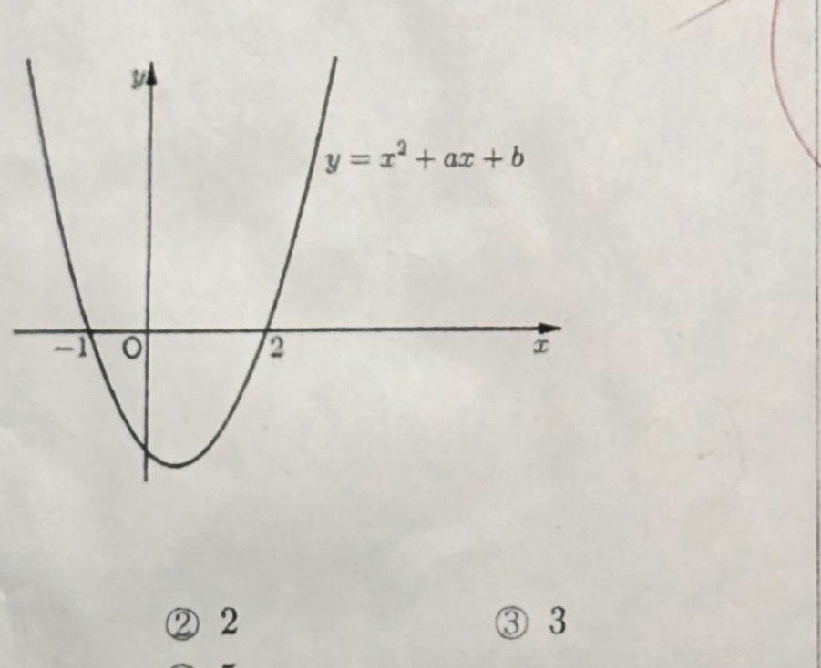

# 공통수학1 — Q1~Q6 (p1, 선택형)

> 2026학년도 제1학기 1차 정기시험 · 제1학년 · 4월 22일 (수) 2교시 · 과목코드 02
> 출처: `01_capture/20260426_수1.jpg`

## 응시 안내
- 문제지: 6면 / 총 20문항 (선택형 18 + 논술형 2)
- 선택형: OMR 컴퓨터용 사인펜 (1~18번)
- 논술형: 검정색 펜 (논술 1~2번)

---

## 선택형

### Q1 [4.0점]
$(2+3i) + (1+i)$ 의 값은? (단, $i = \sqrt{-1}$)

① $2+5i$  ② $3+i$  ③ $3+4i$
④ $4+3i$  ⑤ $5+2i$

### Q2 [4.1점]
두 다항식 $A = 2x^2 - xy - 3y^2$, $B = x^2 + 2xy - 3y^2$ 에 대하여 $A + B$ 를 간단히 하면?

① $-3x^2 - 3xy - 9y^2$  ② $-x^2 - xy - 6y^2$  ③ $x^2 + xy - 6y^2$
④ $x^2 + 3xy - 9y^2$  ⑤ $3x^2 - 3xy$

### Q3 [4.2점]
이차함수 $y = x^2 + ax + b$ 의 그래프가 그림과 같을 때, 이차방정식 $x^2 + ax + b = 0$ 의 두 근의 합은? (단, $a, b$ 는 상수이다.)

> **그림 정보:** 아래로 볼록한 포물선 $y = x^2 + ax + b$. **x절편 = -1과 2.** (두 근의 합 = -1 + 2 = 1)

① $1$  ② $2$  ③ $3$
④ $4$  ⑤ $5$

### Q4 [4.2점]
등식 $a(x-1)^2 + b(x-1) + c = x^2 + 5x$ 가 $x$ 에 대한 항등식일 때, $a + b + c$ 의 값은? (단, $a, b, c$ 는 상수이다.)

① $11$  ② $12$  ③ $13$
④ $14$  ⑤ $15$

### Q5 [4.3점]
다항식 $(x+2)(x+3)(x+4)(x+5) + k$ 가 최고차항의 계수가 1인 이차식의 제곱으로 인수분해될 때, 상수 $k$ 의 값은?

① $-2$  ② $-1$  ③ $1$
④ $2$  ⑤ $3$

### Q6 [4.4점]
이차방정식 $x^2 + 3x + 4 = 0$ 의 두 근을 $\alpha, \beta$ 라 할 때, $\alpha^3 + \beta^3$ 의 값은?

① $-27$  ② $-9$  ③ $18$
④ $36$  ⑤ $54$

---

> 페이지 표시: "6쪽 중 - 1쪽"
> ⚠️ 손글씨: 일부 문항 번호에 빨간펜 동그라미 — 정/오답 확인 필요.
