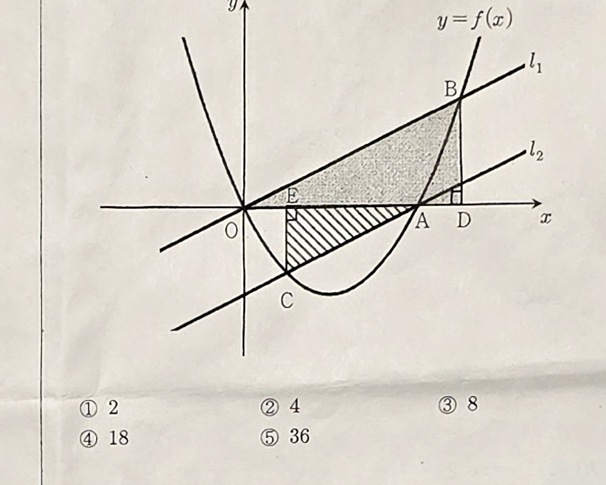

# Q16 — [수학:이차함수활용] / [수학:삼각형넓이최적화]

> **[오답노트 포맷 v1]** — Q16_app.html과 쌍을 이룸

---

## 문제 (원문)
이차함수 $f(x)=\dfrac{1}{2}x^2-2x$의 그래프가 $x$축과 만나는 두 점을 각각 $O$, $A$라 하자.  
$\dfrac{1}{2} \le m \le \dfrac{3}{2}$인 실수 $m$에 대하여 점 $O$를 지나고 기울기가 $m$인 직선 $l_1$이 그래프와 만나는 점 중 $O$가 아닌 점을 $B$, 점 $A$를 지나고 기울기가 $m$인 직선 $l_2$가 그래프와 만나는 점 중 $A$가 아닌 점을 $C$라 하자.  
두 점 $B, C$에서 $x$축에 내린 수선의 발을 각각 $D, E$라 하고, 두 삼각형 $AEC$, $BOD$의 넓이를 각각 $S_1, S_2$라 하자. $S_2-S_1$의 최댓값은? (단, $O$는 원점이다.) [5.7점]

① $2$  ② $4$  ③ $8$  ④ $18$  ⑤ $36$

## 채점
| | |
|---|---|
| 내 답 | 미입력 |
| 정답 | ⑤ $36$ |
| 배점 | 5.7점 |
| 오답 유형 | B, C의 좌표를 $m$으로 표현하지 못하거나, 넓이 공식 적용 오류 |

## § 개념 체크

| # | 질문 | 핵심 답 |
|---|---|---|
| 1 | $f(x)=\frac{1}{2}x^2-2x$의 $x$절편은? | $x=0$(O), $x=4$(A) |
| 2 | $O$를 지나고 기울기 $m$인 직선과 $f(x)$의 교점 $B$의 $x$좌표는? | $mx=\frac{1}{2}x^2-2x$ → $x=2m+4$ |
| 3 | $A(4,0)$을 지나고 기울기 $m$인 직선과 $f(x)$의 교점 $C$의 $x$좌표는? | $x=2m$ |
| 4 | $S_2 = \frac{1}{2}|OD|\cdot|BD|$의 계산 결과는? | $2m(m+2)^2$ |
| 5 | $S_1 = \frac{1}{2}|AE|\cdot|CE|$의 계산 결과는? | $2m(2-m)^2$ |
| 6 | $S_2-S_1$을 $m$으로 표현하면? | $16m^2$ |

## § 풀이 (올바른 접근)

### 1단계: 기준점 설정
$f(x) = \frac{1}{2}x^2-2x = \frac{1}{2}x(x-4)$. 영점: $O=(0,0)$, $A=(4,0)$.

### 2단계: B, C 좌표 구하기
**직선 $l_1$ (O 통과, 기울기 $m$)**: $y=mx$
$$mx = \tfrac{1}{2}x^2-2x \implies x\bigl(\tfrac{1}{2}x-(2+m)\bigr)=0 \implies x=2m+4$$
$$B = (2m+4,\; m(2m+4)) = (2m+4,\; 2m^2+4m)$$

**직선 $l_2$ (A 통과, 기울기 $m$)**: $y=m(x-4)$
$$m(x-4) = \tfrac{1}{2}x^2-2x \implies x^2-(2m+4)x+8m=0$$
$$(x-4)(x-2m)=0 \implies x=2m \quad (x=4\text{는 } A)$$
$$C = (2m,\; m(2m-4)) = (2m,\; 2m^2-4m)$$

**왜 이 단계?** 기울기 $m$인 두 직선이 포물선과 만나는 교점의 $x$좌표를 구해야 넓이를 계산할 수 있다.

### 3단계: 수선의 발 D, E
$$D = (2m+4,\; 0),\quad E = (2m,\; 0)$$

### 4단계: 넓이 계산
$$S_2 = \tfrac{1}{2}\cdot|OD|\cdot|BD| = \tfrac{1}{2}(2m+4)(2m^2+4m) = (m+2)\cdot 2m(m+2) = 2m(m+2)^2$$

$$S_1 = \tfrac{1}{2}\cdot|AE|\cdot|CE| = \tfrac{1}{2}(4-2m)|{2m^2-4m}|$$
$0 \le m \le \frac{3}{2}$이면 $2m^2-4m = 2m(m-2) < 0$이므로 $|2m^2-4m|=2m(2-m)$.
$$S_1 = \tfrac{1}{2}(4-2m)\cdot 2m(2-m) = 2(2-m)\cdot m(2-m) = 2m(2-m)^2$$

### 5단계: 최댓값
$$S_2-S_1 = 2m(m+2)^2 - 2m(2-m)^2 = 2m\bigl[(m+2)^2-(2-m)^2\bigr]$$
$$(m+2)^2-(2-m)^2 = \bigl[(m+2)+(2-m)\bigr]\bigl[(m+2)-(2-m)\bigr] = 4\cdot 2m = 8m$$
$$S_2-S_1 = 2m\cdot 8m = 16m^2$$

$m \in \left[\frac{1}{2},\frac{3}{2}\right]$에서 $16m^2$는 $m=\frac{3}{2}$일 때 최대:
$$16\cdot\frac{9}{4} = \mathbf{36}$$

## § 왜 틀렸나
| 유형 | 구체적 상황 | 교정 포인트 |
|---|---|---|
| 교점 좌표 오류 | B, C의 $x$좌표를 $m$으로 잘못 표현 | 직선-포물선 연립으로 반드시 확인 |
| $C$의 $y$좌표 부호 | $y=2m^2-4m$이 음수임을 놓침 | $0<m<2$에서 $2m(m-2)<0$ 확인 |
| 넓이 식 오류 | $|AE|$를 $4-2m$이 아닌 $2m-4$로 씀 | $\frac{1}{2} \le m \le \frac{3}{2}$이면 $2m \le 3 < 4$, 항상 $4-2m>0$ |

## § 핵심 개념

### 직선과 포물선의 두 번째 교점
기울기 $m$ 직선이 포물선 $y=\frac{1}{2}x^2-2x$와 점 $P$를 제외하고 만나는 점 $Q$의 $x$좌표:  
직선 방정식을 포물선에 대입 → 이차방정식 → 이미 알고 있는 $P$의 $x$좌표로 인수분해.

### 넓이 = $\frac{1}{2}\times$밑변$\times$높이
직각삼각형(밑변이 $x$축 위)의 넓이는 ($x$축 구간)$\times$(높이)/2.

## § 약점 태그
| 태그 | 의미 | 보강 방향 |
|---|---|---|
| `수학:이차함수활용` | 직선-포물선 교점 $m$으로 표현 | 비슷한 교점 계산 문제 반복 |
| `수학:삼각형넓이최적화` | 넓이를 $m$의 함수로 표현 후 최대화 | 넓이 공식 정확히 적용 연습 |
| `수학:차분정리` | $(a+b)^2-(a-b)^2=4ab$ 인수분해 공식 | 합차 공식 암기 |
