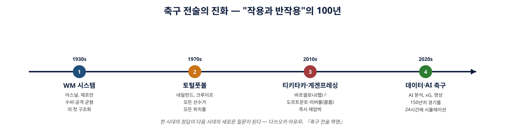
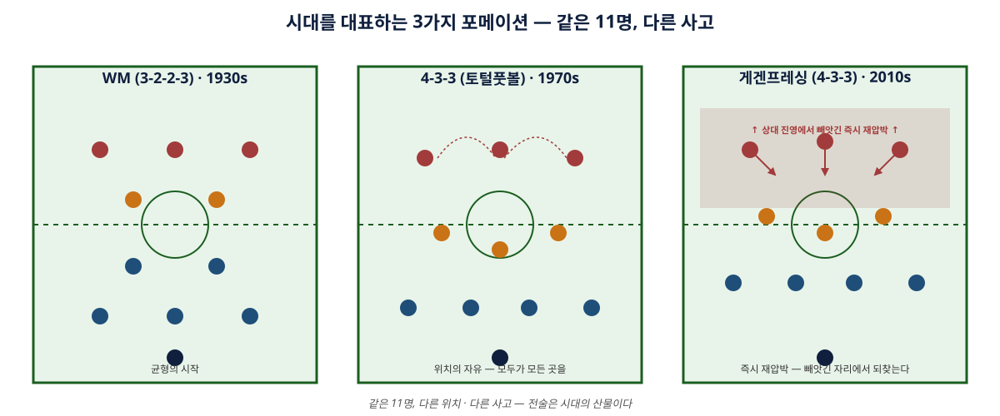
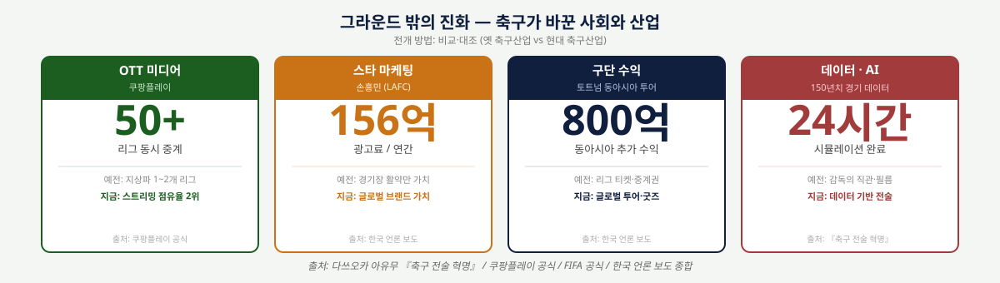
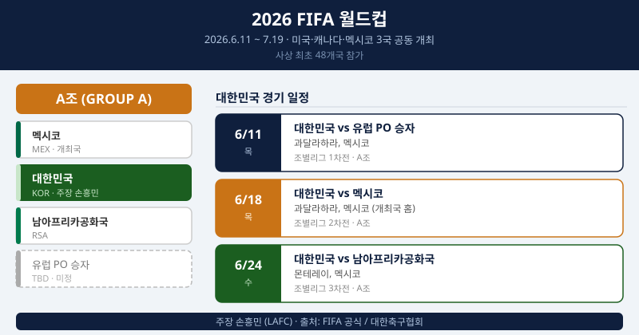

# 07 포스터 시안 v1 — 1장 디자인

> **목표:** 견해문의 핵심을 **포스터 1장(A3 세로)**으로 시각화 → 5월 5주 발표(≈5/25)에 사용.
> **시점 컨셉:** "월드컵 개막 D-약 2주, 다시 펼쳐 본 한 권의 책"
> **시각화 원칙:** 글의 짜임(시간순 + 5종 전개)을 포스터에서도 그대로 살림.

---

## §0. 콘셉트 한 줄

> **"축구 전술의 진화 → 사회 산업의 진화 → 2026 월드컵, 그리고 나의 진로"**

같은 "진화"라는 흐름이 그라운드 안과 밖에서 동시에 일어나고 있음을 한 장에 압축.

---

## §1. 포스터 사양

| 항목 | 권장 |
|---|---|
| **사이즈** | A3 세로 (297 × 420 mm) — 학교 발표 포스터 표준 |
| **여백** | 상하 20mm, 좌우 18mm |
| **폰트** | 본문: 노토산스 KR / 제목: 노토세리프 KR 또는 G마켓산스 |
| **메인 컬러** | 그라운드 그린 `#1b5e20` + 네이비 `#0f1f3d` + 포인트 오렌지 `#c97316` |
| **출력** | A3 컬러 인쇄 (학교 도서관/편의점 / 또는 노트북 화면 발표 가능) |

---

## §2. 전체 레이아웃 (A3 세로 와이어프레임)

```
┌────────────────────────────────────────────────────────────┐
│  ① 헤더 — 제목 + 부제 + 책 표지 썸네일 + 발표자 (높이 ~14%)│
├────────────────────────────────────────────────────────────┤
│  ② 책 정보 박스                  ③ 핵심 메시지 박스        │
│  (작가·감수·출판·페이지)         ("작용과 반작용" 한 줄)   │
│  (높이 ~10%)                                                │
├────────────────────────────────────────────────────────────┤
│                                                             │
│  ④ 전술 진화 타임라인 (가로 풀폭, 4단계)                   │
│     [WM 1930s] → [토털풋볼 1970s] → [게겐프레싱 2010s]      │
│                                       → [데이터·AI 2020s]   │
│  (높이 ~22%)                                                │
│                                                             │
├────────────────────────────────────────────────────────────┤
│  ⑤ 포메이션 비교 (3분할)                                    │
│   [WM]      |     [4-3-3 토털]    |   [게겐프레싱]          │
│  (높이 ~22%)                                                │
├────────────────────────────────────────────────────────────┤
│  ⑥ 사회 산업 진화 (인포그래픽 4박스)                        │
│   [OTT 50개]   [손흥민 156억]   [토트넘 800억]   [AI 150년] │
│  (높이 ~14%)                                                │
├────────────────────────────────────────────────────────────┤
│  ⑦ 2026 월드컵 한국 일정 박스      ⑧ 종합 견해 한 줄       │
│   (6/11 · 6/18 · 6/24 / A조)        (진로 메시지)           │
│  (높이 ~14%)                                                │
├────────────────────────────────────────────────────────────┤
│  ⑨ 푸터 — 출처·QR·로고 (높이 ~4%)                          │
└────────────────────────────────────────────────────────────┘
```

---

## §3. 각 영역 상세

### ① 헤더 영역
- **메인 제목 (큰 글씨):** **「작용과 반작용, 축구 전술이 자라난 100년」**
- **부제 (중간 글씨):** *2026년 6월, 월드컵을 앞두고 다시 펼친 한 권의 책*
- **책 표지 썸네일:** 좌측 (가로 80mm) — 또는 책 이미지 인터넷 검색해서 사용
- **발표자:** 우측 하단 작게 (학년/반/이름)

### ② 책 정보 박스
```
[책 표지 썸네일 작게]
─────────────────────
『축구 전술 혁명』
부제: 축구 명장들의 지략 대결로 읽는
저자: 다쓰오카 아유무
번역: 이지호 / 감수: 한준희(KBS)
한즈미디어 · 2023 · 352쪽
```

### ③ 핵심 메시지 박스 (눈에 띄게)
```
┌────────────────────────────────┐
│  "작용과 반작용"                │
│  한 시대의 정답이                │
│  다음 시대의 새로운 질문이 된다. │
└────────────────────────────────┘
```

### ④ 전술 진화 타임라인 ⭐
- **시각요소:** [`figs/타임라인_전술진화.svg`](figs/타임라인_전술진화.svg) 그대로 사용
- **포인트:** 4개 노드(WM → 토털풋볼 → 게겐프레싱 → AI), 각 노드 아래 한 줄 설명
- **세부 전개 방법 표시 (작게):** "전개 방법: **과정 + 분류**"

### ⑤ 포메이션 비교 ⭐
- **시각요소:** [`figs/포메이션_비교.svg`](figs/포메이션_비교.svg) 그대로 사용
- **3개 그라운드:** WM(3-2-2-3) / 4-3-3 토털 / 게겐프레싱(4-3-3 + 압박 영역)
- **세부 전개 방법 표시 (작게):** "전개 방법: **분석 + 비교·대조**"

### ⑥ 사회 산업 진화 — 4박스 인포그래픽
```
┌──────────┐ ┌──────────┐ ┌──────────┐ ┌──────────┐
│   📺     │ │   ⚽     │ │   💰     │ │   🤖     │
│ OTT 미디어│ │ 스타     │ │ 구단     │ │ 데이터·AI│
│          │ │ 마케팅   │ │ 수익     │ │          │
│ 쿠팡플레이│ │ 손흥민   │ │ 토트넘   │ │ 150년치  │
│ 약 50개   │ │ 광고료   │ │ 동아시아 │ │ 경기를   │
│ 리그 중계 │ │ 156억/년 │ │ 800억    │ │ 24시간에 │
│ 점유율 2위│ │           │ │ 추가수익 │ │ 시뮬레이션│
└──────────┘ └──────────┘ └──────────┘ └──────────┘
```
- **세부 전개 방법 표시:** "전개 방법: **비교·대조** (옛 vs 현대)"

### ⑦ 2026 월드컵 한국 일정 박스
```
┌──────────────────────────────────────────────┐
│  🏆 2026 FIFA 월드컵                         │
│  2026.6.11 ~ 7.19 · 미·캐·멕 3국 · 48개국    │
│  ─────────────────────────────────────────  │
│  대한민국 = A조                              │
│   6/11 vs 유럽 PO 승자  (과달라하라)         │
│   6/18 vs 멕시코 (개최국, 과달라하라)        │
│   6/24 vs 남아프리카공화국 (몬테레이)        │
│  주장 손흥민 (LAFC)                          │
└──────────────────────────────────────────────┘
```

### ⑧ 종합 견해 한 줄 (포스터 결론)
```
┌─────────────────────────────────────────────────┐
│  "전술가는 단지 축구를 잘하는 사람이 아니라,    │
│   경기 전체를 읽고 미래를 설계하는 사람이다.    │
│   책이 보여준 진화의 흐름이                     │
│   곧 내가 따라가야 할 길이다."                  │
└─────────────────────────────────────────────────┘
```
- **세부 전개 방법 표시:** "전개 방법: **인과 + 문제-해결**"

### ⑨ 푸터
- 좌측: "출처: 다쓰오카 아유무 『축구 전술 혁명』 / FIFA 공식 / 쿠팡플레이 / 한국 언론 보도"
- 우측: 학교명·학년·반·이름·발표일

---

## §4. 시각 요소 (SVG 시안)

### 타임라인


### 포메이션 비교


### 사회산업 인포그래픽 (⑥) ⭐ 신규


### 월드컵 한국조 일정 (⑦) ⭐ 신규


> SVG 파일은 그대로 PPT/포토샵/Canva에 임포트하거나, 인쇄 시 PNG로 변환해 삽입.

---

## §5. 컬러 팔레트

| 용도 | 색상 | HEX |
|---|---|---|
| 메인 (그라운드 그린) | 짙은 녹색 | `#1b5e20` |
| 헤더·강조 | 네이비 | `#0f1f3d` |
| 포인트·강조 박스 | 오렌지 | `#c97316` |
| 강한 강조 (게겐프레싱·붉은 영역) | 다크레드 | `#a23b3b` |
| 텍스트 | 다크 그레이 | `#333333` |
| 배경 보조 | 연녹 | `#e8f4ea` |

> 단순한 4컬러 운영이 가독성·인쇄 안전성 모두 좋음. 너무 많은 색은 금물.

---

## §6. 제작 도구 옵션

| 도구 | 추천도 | 장점 | 단점 |
|---|---|---|---|
| **Canva** (무료) | ⭐⭐⭐⭐⭐ | A3 템플릿 풍부, 드래그앤드롭, SVG 임포트 가능 | 일부 폰트 유료 |
| **PowerPoint** | ⭐⭐⭐⭐ | 익숙함, 슬라이드 1장 = A3 사이즈 변경 가능 | 디자인 한계 |
| **Google Slides** | ⭐⭐⭐⭐ | 협업 편함 | 인쇄 품질 보통 |
| **포토샵·Affinity** | ⭐⭐⭐ | 디자인 자유도 최고 | 학습 곡선 |
| **손그림 (전지)** | ⭐⭐ | 차별화·정성 어필 | 시간·정확도 부담 |

> **추천 조합:** Canva로 레이아웃 → 본 가이드의 SVG 두 개 임포트 → A3 PDF 출력 → 학교 인쇄.

---

## §7. 채점 매핑 (포스터 자체도 평가 영역 일부 기여)

| 채점 항목 | 포스터에서 어떻게 |
|---|---|
| A-① 진로 제시 | ⑧ 결론 박스 |
| A-② 진로·책 연관성 | ① 부제 + ⑧ |
| B-① 작가·주제 | ② 책 정보 |
| B-② 책 요약 | ③ 핵심 메시지 + ④ 타임라인 |
| B-③ 외부 자료 재구성 | ⑥ 4박스 인포그래픽 |
| C-② 인상 깊은 부분 | ⑤ 포메이션 비교 (책 속 사례 시각화) |
| C-③ 사회 연결 | ⑥ + ⑦ 월드컵 박스 |
| C-④ 근거 (수치) | ⑥ 인포그래픽의 156·800·50·150 |
| C-⑤ 종합 견해 | ⑧ |
| **C-⑥ 글의 짜임** | 각 영역에 **세부 전개 방법 작은 라벨** 표시 (분석/분류/비교·대조/인과/과정 골고루) |

> ⭐ ⑥번 채점은 견해문에서 본격 평가되지만, 포스터에 "전개 방법: 비교·대조" 같은 작은 라벨을 박아두면 발표할 때 자연스럽게 언급할 수 있음.

---

## §8. 발표 동선 (Phase 4 미리보기)

포스터 위에서 시선을 어떻게 끌고 갈지 — 발표 5분 동선:

```
시작 (10초): ① 제목 → "축구 전술 혁명, 작용과 반작용"
30초: ② 책 정보 + ③ 핵심 메시지
1분: ④ 타임라인 — 4단계 손가락으로 짚으며
1.5분: ⑤ 포메이션 — "같은 11명, 다른 사고"
1분: ⑥ 사회 산업 — 4박스 숫자 강조
30초: ⑦ 월드컵 박스 — "2주 뒤 시작"
30초: ⑧ 결론 — 진로 메시지
```

총 **약 5분.** 시간 부족하면 ⑤를 ④와 통합해 1분, 여유 있으면 ⑥에서 자세히.

---

## §9. 다음 단계

### 즉시 가능한 것
- [ ] Nick: Canva 계정 (또는 PPT) 결정
- [ ] 책 표지 이미지 입수 (교보문고/알라딘에서 캡쳐 가능 — 출처 표기)
- [ ] 본 시안의 ①~⑨ 영역을 도구에 그대로 옮기기

### Claude 추가 작업 가능
- (Q) ⑥ 인포그래픽을 SVG로 만들어드릴까요? (4박스 디자인)
- (Q) ⑦ 월드컵 박스를 SVG로 만들어드릴까요? (조 추첨 + 일정)
- (Q) Canva용 A3 PDF 시안 만들기 (텍스트 배치까지)
- (Q) Phase 4 발표 스크립트 (5분 분량) — 발표 동선 §8 기반으로 풀어쓰기

→ 필요한 것 골라주시면 진행.
