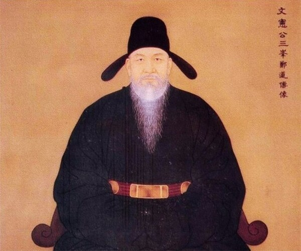
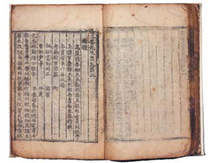
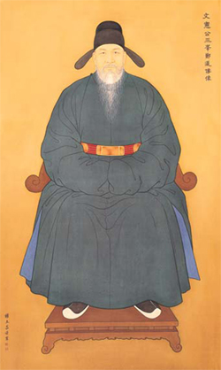

# 03_search — 정도전 자료 수집

## 1. [송백 칼럼] 재상정치를 꿈꾼 정도전, 그는 조선 건국의 핵심 인물이자 개혁가였다

( https://www.ndnnews.co.kr/news/articleView.html?idxno=681234 )

(기자명 신현두 칼럼니스트   입력 2024.09.09 11:47)

정도전 초상화 (사진출처=삼봉 정도전 기념관)

정도전(鄭道傳, 1342년 10월 6일 ~ 1398년 10월 6일)은 고려 말과 조선 초기에 활동한 문신, 유학자, 그리고 혁명가다. 그의 본관은 봉화이며, 자는 종지이며 조선을 건국하는 데 중요한 역할을 한 개국 공신으로, 특히 이성계를 도와 조선 왕조를 세우는 데 기여했다.

정도전은 고려 왕조의 말기에 성균시에 합격하여 관직 생활을 시작했으며, 이후 조선 건국에 참여하여 다양한 개혁을 추진했다. 그는 조선의 정치, 경제, 철학 사상에 큰 영향을 미쳤으며, 민본사상을 강조하여 백성을 나라의 근본으로 삼았다. 그는 또한 조선 왕조 500년의 기틀을 다지는 데 중요한 역할을 했다.

그러나 정도전은 태종 이방원에 의해 제거되었고, 그의 사상과 업적은 한동안 폄하되기도 했다. 이후 흥선대원군에 의해 복권되었으며, 조선 후기에는 그의 업적이 재평가되었다.

정도전과 이성계의 관계는 매우 밀접하고 복잡했다. 정도전은 이성계를 조선 왕조 건국의 핵심 인물로 선택하고 지원했다. 그는 이성계를 내세워 자신이 구상한 새로운 국가를 건설하고자 했다. 이들의 관계는 흔히 중국 한나라의 유방과 그의 참모 장량의 관계에 비유되곤 한다.

정도전은 자신과 이성계의 관계를 설명할 때, "한 고조가 장량을 이용한 게 아니라 거꾸로 장량이 한 고조를 이용했다"고 말했다. 이는 정도전이 이성계를 자신의 정치적 이상을 실현하기 위한 도구로 여겼음을 암시한다.

조선 건국 초기에 정도전과 이성계의 관계는 매우 긴밀했다. 이성계는 정도전이 추진하고자 하는 개혁을 적극적으로 지원했고, 둘의 관계는 '수어지교'(물고기와 물의 친밀한 관계)로 표현될 정도로 가까웠다.

그러나 이들의 관계가 항상 순탄했던 것은 아니다. 드라마 "정도전"에서는 이성계와 정도전이 초반부터 자주 의견 충돌을 겪는 모습이 묘사되기도 했다. 이는 두 사람의 관계가 단순한 군신 관계를 넘어 복잡하고 때로는 갈등적이었음을 보여준다. 결국 정도전은 이성계의 아들인 이방원(후의 태종)에 의해 제거되었는데, 이는 정도전과 이성계 가문 간의 복잡한 권력 관계를 보여주는 사건이라고 할 수 있다.

정도전과 이방원의 관계는 복잡하고 갈등적이었다. 조선 건국 과정에서 정도전과 이방원은 함께 일했고 이방원은 정몽주 제거 등 중요한 역할을 수행했다. 정도전은 어린 세자 방석을 교육시켜 재상 중심의 왕도 정치를 실현하고자 했다. 이방원은 이를 자신의 왕권과 입지를 약화시키는 위협으로 인식했고 이방원은 정도전을 "눈엣가시"로 여기게 되었다.

결국 이방원은 제1차 왕자의 난을 일으켜 정도전을 살해하고 세자 방석도 제거했다. 정도전은 재상 중심의 정치를 추구했지만, 이방원은 강력한 왕권을 원했다. 이는 두 사람의 근본적인 정치 철학 차이를 보여준다. 태종 이방원은 의도적으로 정도전을 폄하하고 정몽주를 현창했다. 이로 인해 정도전은 한동안 부정적으로 평가되었다.

정도전과 이방원의 관계는 초기의 협력에서 시작해 점차 심각한 대립으로 발전했고, 결국 비극적인 결말을 맞이했다. 이는 조선 초기 정치 구도의 복잡성과 권력 투쟁의 양상을 잘 보여준다.

정도전과 정몽주는 두 사람은 고려의 개혁적 지식인으로, 공민왕과 함께 고려의 개혁을 추진했다. 두 사람은 개혁과 혁명이라는 문제에서 갈등을 겪었다. 정도전은 조선 건국을 위한 역성혁명을 지지했으나, 정몽주는 고려의 충신으로서 혁명에 반대했다. 정몽주는 개혁을 통해 고려를 유지하고자 했으며, 이를 위해 자신의 목숨을 걸기도 했다. 정몽주는 정도전의 혁명 계획에 반대하며, 이를 추궁하기도 했다. 결국, 두 사람의 신념 충돌은 정몽주의 죽음으로 이어졌다. 이처럼 정도전과 정몽주는 초기에는 같은 목표를 공유했으나, 정치적 상황과 신념의 차이로 인해 결국 갈등하게 되었다.

정도전과 정몽주의 관계는 후대에 여러 가지 중요한 영향을 미쳤다. 정도전은 혁명과 개혁을 상징하게 되었고, 정몽주는 충절과 보수를 대표하는 인물로 자리잡았다. 조선 초기에는 정도전의 업적이 폄하되고 정몽주가 현창되었다. 그러나 시간이 지나면서 두 인물에 대한 평가가 균형을 이루게 되었다.

두 인물의 선택은 충절이냐 혁명이냐의 딜레마다. 국가의 위기 시 어떤 길을 택해야 하는지에 대한 후대의 논쟁을 불러일으켰다. 두 사람 모두 뛰어난 학자이자 정치인이었다는 점에서, 학문과 정치의 관계에 대한 후대의 고민을 자극했다. 두 인물의 관계는 많은 문학 작품의 소재가 되어, 한국 문학사에 중요한 영향을 미쳤다. 두 인물의 삶과 선택은 후대 교육에서 중요한 토론 주제가 되었다.

정도전과 정몽주의 관계는 단순한 역사적 사실을 넘어, 한국의 정치, 문화, 교육 전반에 걸쳐 깊은 영향을 미쳤다. 그들의 이념적 대립과 선택은 오늘날까지도 많은 사람들에게 중요한 성찰의 기회를 제공하고 있다.

정도전의 재상정치는 그의 정치 철학과 개혁 의지를 잘 보여주는 핵심적인 구상이다. 재상정치는 왕권을 제한하고 재상의 권한을 강화하는 정치 체제다. 그는 임금은 세습되는 직책이라 어리석은 임금이 나올 수도 있다고 보았고, 이에 대한 대안으로 재상 중심의 정치를 구상했다. 정도전은 재상이 중심이 되는 왕도 정치의 실현을 꿈꾸었다. 그의 재상정치 구상은 성리학적 이념에 기초한 이상 국가를 실현하기 위한 것이었다.

정도전은 어린 세자 방석을 교육시켜 자신의 정치 이념을 실현하고자 했다. 이는 세자를 통해 재상 중심의 정치 체제를 구축하려했다. 그러나 정도전의 재상정치 구상은 한계에 부딪혔다. 이방원을 비롯한 왕자들은 왕권 약화를 우려하여 정도전의 구상에 반대했다. 재상정치 추진은 왕자들, 특히 이방원과의 갈등을 심화시켰다. 결국 이방원이 주도한 제1차 왕자의 난으로 정도전은 살해되고, 그의 재상정치 구상도 좌절되었다.

정도전의 재상정치 구상은 조선 초기 정치 체제의 방향을 둘러싼 중요한 논쟁을 불러일으켰으며,그의 급진적 개혁 의지를 보여주는 대표적인 사례로 평가된다.

정도전의 사후 그의 명예와 평가는 시대에 따라 변화를 겪었다. 정도전이 피살된 직후, 그의 정적들에 의해 그의 명예가 크게 실추되었다. 그에 대한 비판이나 부정적 견해가 일반화되었다. 영조와 정조 시대에 이르러 정도전에 대한 평가가 점차 개선되기 시작했다. 조선 후기에 정도전의 문집이 편찬되고 출간되었으며, 조정의 중신들이 서문을 써주는 등 그의 업적에 대한 재조명이 이루어졌다. 고종 때 정도전이 공식적으로 복권되면서 그의 업적이 본격적으로 재평가되기 시작했다. 현대에 이르러 정도전의 사상과 업적에 대한 학술적 연구가 활발히 진행되고 있다. 조선 건국의 핵심 인물이자 개혁가로서 정도전의 역할이 긍정적으로 평가되고 있다.

정도전의 명예는 그의 사후 즉각적으로 실추되었지만, 시간이 지남에 따라 점진적으로 회복되어 현재는 조선 초기의 중요한 정치가이자 사상가로 인정받고 있다. 그러나 그의 급진적 개혁 방식과 권력 욕심에 대한 비판적 시각도 여전히 존재한다.

출처 : 엔디엔뉴스(https://www.ndnnews.co.kr)

## [Art & Culture] 2014 대한민국은 왜 鄭道傳에 열광하는가

(https://www.mk.co.kr/news/special-edition/5972117)
(업데이트 : 2014.03.07 19:21)

_거침없는 개혁·백성 근본주의…`이 남자의 혁명` 속이 뻥 뚫린다_

노론의 영수 송시열은 현종 10년(1669년) 1월 27일 태조 이성계의 계비이자 세자 방석의 친모인 신덕왕후를 종묘에 배향할 것을 청하는 상소를 올린다. 그는 조선 건국의 기틀을 다진 정도전을 두고 "간신 정도전 등이 위험한 말로 선동하여 두 왕자를 요절하게 만들었으니 간신의 죄를 어찌 다 벌할 수 있겠느냐"고 비난했다. 조선 5대 왕인 문종은 즉위 첫해인 1451년 11월 1일 억울하게 죽은 고려 왕씨들의 제사를 지낼 후손을 찾을 것을 명하면서 "개국 초 왕씨들을 참혹하게 대우한 일은 진실로 태조의 본의가 아니고 모신(謀臣)들이 한 바이다. 모신은 바로 정도전의 무리"라고 했다. 삼봉 정도전은 1392년 이성계를 왕으로 옹립하고 조선의 토대를 만들었다. 그러나 이방원이 일으킨 1차 왕자의 난(1398년) 때 역적의 죄를 쓴 채 살해됐으며 사후 467년이 지난 고종 2년(1865년)에야 공신 칭호를 다시 받아 명예를 회복한다.

왕조의 설계자로서 타의추종을 불허하는 혁혁한 공을 세우고도 조선조 내내 역적과 간신의 대명사로 비난받아야만 했던 삼봉. 그런 그의 삶과 사상이 지금 다시금 주목받고 있다.

우선 연초부터 방영되고 있는 KBS 주말극 '정도전'의 인기가 회를 거듭할수록 높아지고 있다. 자칫 지루할 수 있는 정통 사극을 표방했는데도 시청률이 14%대를 웃돌면서 같은 시간대 1위까지 넘보고 있다. 중장년층은 물론 퓨전 사극에 길들여진 청소년들까지 TV 앞으로 끌어모으고 있다.

_도올 김용옥이 혁명의 책이라고 칭한 '삼봉집'._

출판계도 '정도전 바람'으로 후끈 달아오르고 있다. 올해 들어서만 김탁환의 소설 '혁명'(민음사)을 비롯해 이덕일의 '정도전과 그의 시대'(옥당), 조유식의 '정도전을 위한 변명'(휴머니스트), 박봉규의 '광인 정도전'(아이콘북스) 등 그와 관련한 책이 서점가에 쏟아져 나오고 있다. 이 시점에서 왜 정도전인가. 삼봉은 한 시대를 풍미한 혁명아였지만 그 출신은 미천했다. 집안은 대대로 고향 영주에서 향리 벼슬을 지냈다. 심지어 실록에는 "승려 김진이 종의 아내와 간통해 도전의 외조모를 낳았다"고 적혀 있다. 종의 자식은 천민이니 곧 그의 어머니 우씨 부인 역시 천민인 셈이다. 고려 땐 서얼 차별이 없어 과거에 나갈 수 있었지만 "천한 곳에서 몸을 일으켜 높은 벼슬에 올랐다"는 비판이 꼬리표처럼 따라다니면서 그를 괴롭혔다.

이런 한계에도 불구하고 그는 현실과 타협하지 않았다. 고려 조정의 친원 외교 노선을 반대하다가 당시 실권자 이인임의 미움을 사 3년 유배 생활을 포함해 10년 동안 떠돌이 생활을 했다.

삼봉은 유배지에서 귀족들에게 땅을 빼앗기고 반노비 신세로 전락한 민초들을 접한다. 그들의 처참한 삶을 통해 '민이 나라의 근본'이라는 공맹의 가르침을 피부로 실감하고 정치란 벼슬아치들의 입신양명을 위한 것이 아니라 농사 짓는 백성들을 위한 것이어야 함을 가슴 깊이 깨우친다.

'조선경국전' 서문에서 그는 "단 한 번이라도 임금이 백성의 마음을 얻지 못한다면 그들은 곧 임금을 버릴 것이다. 힘으로 겁줄 수 없고, 지혜로서 속일 수 없다"고 가감 없이 표현했다. 나라 안의 모든 농민에게 토지를 분배해야 한다는 시대를 초월한 토지 사상도 구상한다.

권세가들이 모든 것을 장악하고 있는 구 체제 아래에서는 개혁이 불가능했다. 1383년 42세의 삼봉은 오랜 유랑을 끝마치고 마침내 혈혈단신으로 군벌로 성장한 이성계를 찾아가면서 역성혁명에 온몸을 불사른다. 개국 후 죽기까지 6년의 짧은 기간 이룩한 그의 업적은 실로 놀랍다.

조선시대 헌법에 해당하는 '조선경국전'과 정치구조ㆍ관료체계를 정리한 '경제문감'을 통해 국가 통치의 기초를 확립했으며 '불씨잡변'을 지어 불교를 비판하고 성리학을 국가 이념으로 삼는다. 국호를 '조선'으로 정하고 이씨 왕조 개국을 정당화하기 위해 '고려사'도 편찬했다. 한양 천도를 책임지면서 궁궐과 종묘의 위치, 전각의 이름까지 직접 고안했고 서울을 5부 52방으로 개편했는데 오늘날 많은 행정구역과 그 명칭이 이로부터 유래한다. '진법' '오행진출기도' '강무도' 등 다수의 병법 이론서를 펴냈고 종묘에 사용된 예식이나 궁중음악도 그의 손을 거쳤다. 과전법을 실시해 토지제도의 개혁을 단행했다.

그가 꿈꾸던 정치체제는 재상국가였다. 정도전은 이성계에게 왕의 자리는 줄지언정 나라를 넘길 생각은 조금도 없었다. 실록에 따르면 그는 공공연하게 "한고조가 장자방을 쓴 것이 아니라 장자방이 곧 한고조를 쓴 것"이라고 얘기하고 다녔다.

왕은 절대권력을 가진 존재가 아니라 유능한 재상을 선출하고 이들이 합리적으로 정사를 결정할 수 있도록 돕는 역할에 머물러야 한다고 생각했다. 왕권을 강화하고 조선을 이씨들의 나라로 만들려는 이방원과는 근원적으로 함께할 수 없었다.

_권오창 화백이 그린 정도전 표준영정._

정도전은 사병혁파를 통해 중앙집권체제를 세우려 했다. 고토인 요동 수복을 말년에 필생의 사업으로 삼고 해산된 사병을 훈련시켰다. 이 과정에서 훈련에 소극적인 왕자들에게 태형을 가했고, 이에 불만을 품은 이방원의 습격을 받아 목숨을 잃는다. 왕이 백성 위에 군림했던 조선에서 백성의 나라를 만들려고 했던 그는 위험천만한 인물이었다. 최근 정도전이 새롭게 조명받고 있는 데 대해 사가들은 여말선초 격동의 시대와 절묘하게 오버랩되는 오늘날 혼란스러운 정치ㆍ사회 현실에 주목한다.

이덕일 한가람역사문화연구소 소장은 "중국의 부상과 일본의 우경화로 국제 정세가 예측 불허의 혼란을 겪고 있고, 국내적으로도 청년실업과 양극화 문제가 갈수록 심해지고 있는 현 상황은 원명교체기에 토지제도가 극도로 문란해진 여말과 매우 흡사하다"며 "그런데도 정치권은 문제의 심각성을 인식하지 못한 채 오히려 네 탓 공방만 하면서 국민을 실망시키고 있다"고 말했다.

정도전은 법ㆍ제도에서 종교, 국방, 도읍지, 조세, 교육에 이르기까지 헤아릴 수 없이 많은 저술을 남긴 대학자이면서 이론에만 밝은 경세가가 아니라 현장을 아는 실천가였다. 더욱이 그는 시대를 뛰어넘어 백성의 귀중함을 알았고, 국왕과 관료는 백성을 위해 존재한다고 믿었던 사람이다.

도올 김용옥은 '정도전의 건국철학'이라는 책에서 "이념의 설계를 완성했고 그 설계를 구체적 현실로서 실현할 수 있는 권력을 장악하는 데 성공했다"며 "그는 좌절된 몽상가가 아니라 치열한 현실의 승자"라고 했다. 이어 그는 "위대한 정치 지도자를 바라는 우리의 갈망에 부합하는 인물이며 우리 역사에서 그를 뛰어넘는 인물을 발견하기 어렵다"고 말했다.

답답한 현실에서 우리 국민은 백성을 위한 정치를 꿈꿨고 실천했으며, 이를 위해 목숨까지 바친 정도전과 같은 선구적 리더의 등장을 애타게 기다리고 있는지도 모른다.

■ 단양·종로구청엔 '三峰'의 향기가…

_충북 단양의 도담삼봉_

정도전(1342~1398)은 본관이 봉화다. 선향이 경북 영주지만 태어난 곳은 도담삼봉으로 유명한 충북 단양이다. 단양은 외가가 있던 곳이다. 그의 호 삼봉(三峰)은 도담삼봉에서 따왔다고 전해진다. 1388년 '삼봉에 올라'라는 시도 남겼다.

일찌감치 개경으로 올라온 그는 19세에 성균시, 21세에 진사시에 합격해 벼슬을 시작했다. 조선 개국 후 정도전이 살던 한양 집은 수진방에 있었는데 현재의 종로구청 자리다. 실제 종로구청 정문에는 '정도전 집터'라는 비석이 세워져 있다.

그는 심효생 등과 송현에 있는 남은의 첩 집에 머물다가 이방원 일당에 의해 살해됐다. 종로구 수송동 옛 한국일보 자리다.

정도전에게는 4명의 아들이 있었다. 둘째 유와 셋째 영은 그와 함께 피살되고 넷째 담은 스스로 목숨을 끊었다. 맏아들 진은 한양을 떠나 있어 멸문지화는 면했다. 정도전은 역적의 멍에를 벗지 못했지만 아들은 태종 사망 후 벼슬이 형조판서에까지 올랐으며 증손자는 세조 때 우의정을 지냈다.

당시 정도전의 용모를 추정할 수 있는 기록이 일부 남아 있다. 권근은 '삼봉 선생 진찬'에서 "얼굴이 윤택하다"고 썼고 태조실록은 "배가 불룩하다"고 묘사했다. 비만형 체질임을 짐작할 수 있다.

초상화 전문 작가인 권오창 화백의 국가표준영정(1994년 지정)은 후손들의 얼굴과 골격 특징을 참고해 그려졌다.

[배한철 기자 / 자료 제공 = 휴머니스트]

